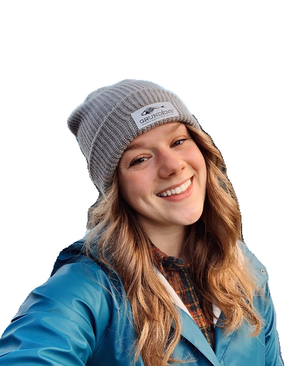

# Background Removal application for selfies and portraits using Deep Neural Networks.
<ul>

<ul/>
Removal of Background using Deep Learning. This repo contains code for API & script to remove the background from selfies and portrait images. The input images should contain the subject properly focused and nearly centered for the best results however it can work on non-centered and slightly less focused images too! 

Here, we make use of the State Of the Art deep learning model Xception, published by google research team.

The weights of Xception model needs to be downloaded before running the scripts. The script to serve the model via REST API is also provided. 

## Setup
#### 1. Downloading the weight file
The script setup.sh downloads the trained model and sets it up so that the seg.py script can understand. 
>	./setup.sh
#### 2. installing the required packages
pip3 -r install requirements.txt

### Running the script
* To run the script and test on sample image, run the script as specified below:
>	python3 seg.py sample.jpg output/output.png 1

* For starting flask api server run:
>	python3 seg_flask.py 

and then use curl to call the API. 

### Dependencies
Check requirements.txt for python packages dependencies. If GPU is available make sure to install tensorflow with GPU support(i.e. with cuda and cudnn libreries) and then run the scripts for better speed. 

## Future Work
* Finetune the model for better detection around edges 
* Improve the model's performance on body and background sepration
* Add feture to upscale images
* Improve the overall detection in case of people in images
* Add background removal support for various day to day objects and handwritings. 